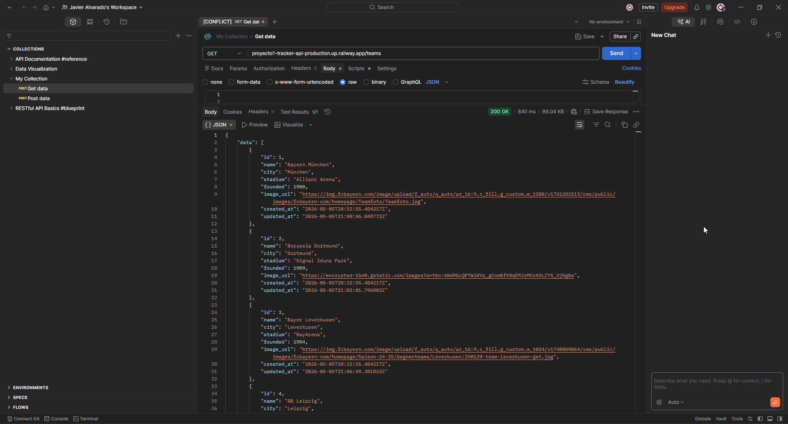

# Bundesliga Tracker — API

REST API en Go + PostgreSQL para gestionar equipos de la Bundesliga alemana.

> 🔗 **Frontend:** https://github.com/jsam1904/Proyecto1-Bundesliga-Client

## Screenshot



---

## Stack

| Tecnología | Rol |
| --- | --- |
| Go 1.21 | Lenguaje del servidor |
| chi v5 | Router HTTP |
| PostgreSQL | Base de datos |
| `database/sql` + `lib/pq` | Driver de base de datos |
| godotenv | Variables de entorno |
| nixpacks | Build / deploy |

---

## Correr el proyecto localmente

### Prerrequisitos

- [Go 1.21+](https://go.dev/dl/)
- PostgreSQL corriendo localmente (puerto 5432 por defecto)

### Pasos

```bash
# 1. Clonar el repositorio
git clone https://github.com/jsam1904/Proyecto1-Tracker-Api.git
cd Proyecto1-Tracker-Api

# 2. Copiar y editar variables de entorno
cp .env.example .env
# Abre .env y pon tus credenciales de PostgreSQL
```

**.env mínimo:**

```env
PORT=8080
DB_HOST=localhost
DB_PORT=5432
DB_USER=postgres
DB_PASSWORD=tu_contraseña
DB_NAME=bundesliga
DB_SSLMODE=disable
```

```bash
# 3. Crear la base de datos y correr la migración
#    En Linux/Mac o Git Bash (Windows):
chmod +x setup.sh && ./setup.sh

#    En Windows (PowerShell / CMD, sin setup.sh):
psql -U postgres -c "CREATE DATABASE bundesliga;"
psql -U postgres -d bundesliga -f db/migrations/001_init.sql

# 4. Instalar dependencias e iniciar el servidor
go mod download
go run main.go
```

El servidor queda en **`http://localhost:8080`** (o el puerto definido en `PORT`).

---

## Endpoints

| Método | Ruta | Descripción |
|--------|------|-------------|
| `GET` | `/teams` | Listar equipos (soporta búsqueda, paginación y orden) |
| `GET` | `/teams/{id}` | Obtener un equipo por ID |
| `POST` | `/teams` | Crear un nuevo equipo |
| `PUT` | `/teams/{id}` | Actualizar un equipo (campos opcionales) |
| `DELETE` | `/teams/{id}` | Eliminar un equipo |

### Query params de `GET /teams`

| Param | Descripción | Ejemplo |
| ----- | ----------- | ------- |
| `q` | Búsqueda parcial por nombre | `?q=bayern` |
| `page` | Página (default: 1) | `?page=2` |
| `limit` | Resultados por página (default: 10) | `?limit=5` |
| `sort` | Campo de orden: `name`, `city`, `founded`, `stadium`, `id` | `?sort=founded` |
| `order` | Dirección: `asc` o `desc` (default: `asc`) | `?order=desc` |

### Payload (POST / PUT)

```json
{
  "name": "FC Bayern München",
  "city": "München",
  "stadium": "Allianz Arena",
  "founded": 1900,
  "image_url": "https://example.com/logo.png"
}
```

- `name`, `city`, `stadium`, `founded` son **obligatorios** al crear.
- En `PUT`, todos los campos son **opcionales**.

### Códigos HTTP

| Código | Cuándo |
|--------|--------|
| 200 | GET / PUT exitoso |
| 201 | POST exitoso |
| 204 | DELETE exitoso |
| 400 | Input inválido (responde JSON con detalle del error) |
| 404 | Recurso no encontrado |
| 500 | Error interno del servidor |

---

## Challenges implementados

- [x] **Códigos HTTP correctos** — cada operación devuelve el status code semánticamente correcto (200, 201, 204, 400, 404, 500).
- [x] **Validación server-side** — el servidor valida el JSON de entrada y responde con un objeto de errores descriptivo por campo.
- [x] **Búsqueda** — `GET /teams?q=` hace búsqueda parcial e insensible a mayúsculas sobre el nombre del equipo.
- [x] **Paginación** — `GET /teams?page=&limit=` pagina los resultados; la respuesta incluye `total` y `total_pages`.
- [x] **Ordenamiento** — `GET /teams?sort=&order=` permite ordenar por cualquier campo soportado en ambas direcciones.

---

## Reflexión

### Go + chi

Go resultó una elección sólida para una API REST. El modelo de concurrencia con goroutines es simple de razonar, el compilador es estricto y el binario resultante es pequeño y rápido de arrancar. `chi` agregó routing con parámetros y middlewares sin requerir frameworks pesados, lo que mantuvo el proyecto fácil de entender.

Lo más costoso fue la verbosidad de `database/sql`: cada query requiere escribir el SQL a mano, hacer el `Scan` de cada columna y manejar `sql.ErrNoRows` explícitamente. Un ORM como GORM reduciría ese boilerplate, pero a cambio perdería el control fino sobre las queries, que en este caso fue útil para combinar búsqueda, paginación y ordenamiento en una sola query dinámica.

### ¿Lo volvería a usar?

**Sí**, especialmente para APIs donde el rendimiento y la predictibilidad importan. Go obliga a ser explícito en casi todo, lo que hace que el código sea más fácil de mantener a largo plazo que soluciones más "mágicas". Para un proyecto pequeño como este, el overhead de configuración fue bajo y el resultado fue una API confiable y rápida.

Si tuviera que cambiar algo, usaría `pgx` en lugar de `lib/pq` (mejor soporte para tipos de PostgreSQL y mejor rendimiento) y consideraría un query builder como `sqlc` para evitar SQL en strings sin perder control sobre las queries.
